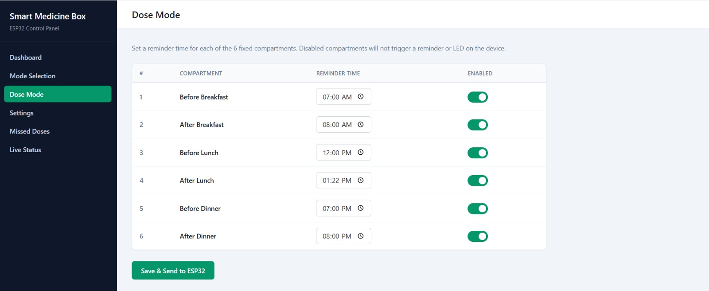
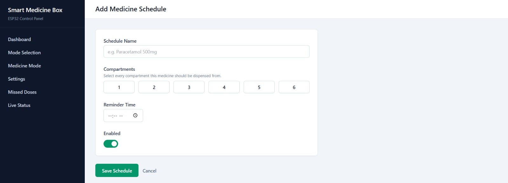
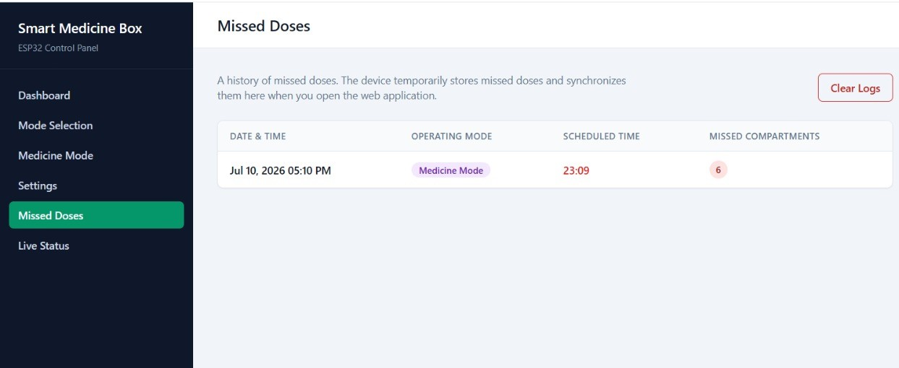
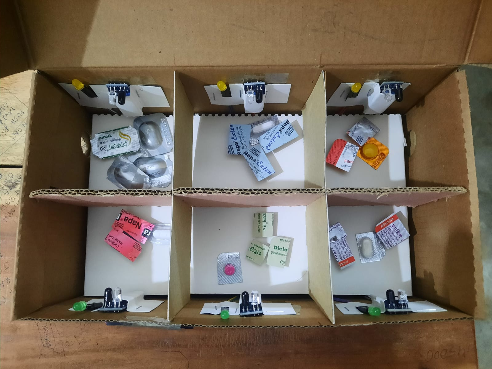
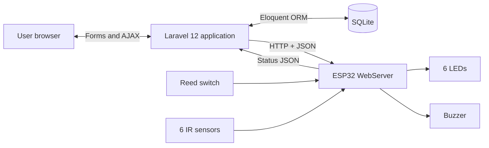
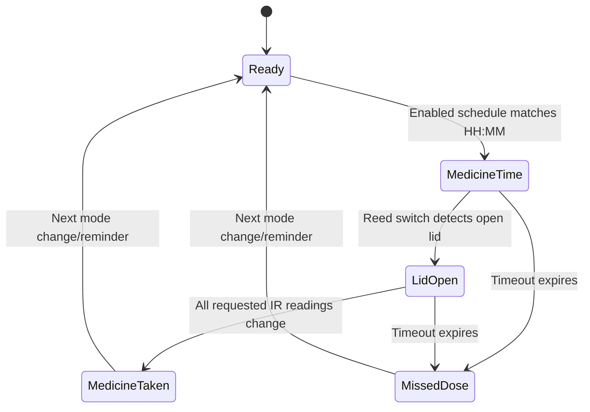
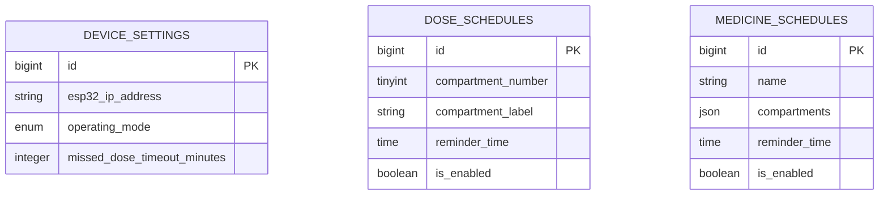

# 💊 Smart Medicine Box

An IoT-based Smart Medicine Box powered by an **ESP32 microcontroller** and a modern **Laravel web application**. This project ensures patients never miss a dose by combining physical hardware alerts (LEDs, buzzer, sensors) with a real-time, easy-to-use web interface for scheduling and monitoring.


---

## 📷 Preview

| | |
|:---:|:---:|
| **Dose Mode**<br> | **Medicine Mode**<br> |
| **Missed Dose**<br> | **Hardware**<br> |
---

##  Features

- **Two Operating Modes**
  - **Dose Mode** — Schedule reminders per physical compartment (e.g., Morning Dose, Evening Dose), one time slot per compartment.
  - **Medicine Mode** — Group any subset of the 6 compartments under a named medicine and schedule it independently, with support for up to 20 named medicines.
- **Physical Alerts** — An active buzzer and per-compartment LEDs guide the user directly to the medicine they need to take.
- **Smart Sensors**
  - A **reed switch** detects when the box lid is opened.
  - **6× IR obstacle sensors** (one per compartment) detect when medicine has been physically removed, using a baseline-comparison technique to avoid false positives from empty compartments.
- **Two-Phase Detection Logic** — Waits for the lid to open (Phase 1), then monitors each pending compartment's IR sensor against a captured baseline until all medicine is collected (Phase 2).
- **Missed Dose Tracking** — Automatically detects and logs doses not collected within a configurable timeout window, recording the exact compartments that were missed.
- **Resilient Log Delivery** — Since the ESP32 never initiates outbound requests, missed-dose events are buffered on-device and piggybacked onto the next status poll, then acknowledged by the web app — so no data is lost even if the web app is briefly down.
- **Real-Time Web Dashboard** — A Tailwind CSS–powered Laravel app for configuring schedules, viewing live box status (polled every 5s), and reviewing/clearing missed-dose history.
- **Device Utilities** — Sync the ESP32's clock directly from the browser, remotely restart the device, and test connectivity from the dashboard.

---

##  System Architecture

```
┌─────────────────────┐        HTTP / JSON          ┌──────────────────────┐
│   Laravel Web App   │  ────────────────────────▶ │   ESP32 WebServer     │
│  (Tailwind CSS UI)  │  ◀──────────────────────── │   (medicine_box.ino)  │
└─────────────────────┘   polled every 5 seconds    └──────────┬───────────┘
                                                               │
                                                   Digital I/O │
                                                               ▼
                                              ┌─────────────────────────────┐
                                              │  Hardware Layer             │
                                              │  • 6× LEDs (per compartment)│
                                              │  • 6× IR sensors            │
                                              │  • 1× Reed switch (lid)     │
                                              │  • 1× Active buzzer         │
                                              └─────────────────────────────┘
```

**Data flow:** Web App (Laravel) → HTTP/JSON → ESP32 WebServer → Hardware (LEDs, Buzzer, Reed Switch, IR Sensors) → Status → HTTP/JSON → Web App (polled every 5s)

The ESP32 always acts as the **HTTP server**; it never opens outbound connections. This is why missed-dose logs use a **poll-and-piggyback** pattern instead of a push/webhook — the device queues log entries in RAM and the web app collects them on its next `/status` poll, then explicitly acknowledges receipt via `/clear-logs`.

---

##  Hardware Requirements

| Component | Quantity | Notes |
|---|---|---|
| ESP32 Development Board | 1 | Hosts the WebServer and all control logic |
| IR Obstacle Sensor (FC-51 or similar) | 6 | One per compartment, detects medicine removal |
| 5mm LED | 6 | One per compartment, lights up during a reminder |
| Magnetic Reed Switch (Normally Open) | 1 | Detects when the box lid is opened |
| Active Buzzer (3.3V) | 1 | Audible alert; driven with `digitalWrite` for full volume |
| Jumper wires, resistors, enclosure | — | Standard prototyping hardware |

### Pin Configuration

| Constant | Values | Purpose |
|---|---|---|
| `IR_PINS[6]` | `{15, 19, 4, 16, 17, 5}` | IR sensor OUT pins, compartments 1→6 |
| `LED_PINS[6]` | `{18, 2, 21, 25, 33, 32}` | LED pins, compartments 1→6 |
| `REED_PIN` | `22` | Lid reed switch (`INPUT_PULLUP`) |
| `BUZZER_PIN` | `23` | Active buzzer output |
| `REED_TAKEN_STATE` | `HIGH` | Pin state meaning "lid open" |

All hardware pins are defined as named constants at the top of the firmware, so rewiring only ever requires editing this one section.

---

##  Software Stack

- **Firmware:** C++ (Arduino framework) on ESP32, using `WebServer` and `ArduinoJson`
- **Backend:** Laravel (PHP), SQLite database
- **Frontend:** Blade templates + Tailwind CSS
- **Communication:** REST-style HTTP/JSON between Laravel and the ESP32, polled every 5 seconds

### Key Firmware Design Points

- **Two-phase pickup detection:** Phase 1 waits for the reed switch to signal the lid opening, then captures a baseline IR reading for every compartment. Phase 2 compares each compartment's live IR reading against that baseline — a *change* means the medicine was removed. This baseline approach avoids false "taken" readings from compartments that read HIGH even when empty.
- **Non-blocking time reads:** `getHHMM()` calls `getLocalTime()` with a 0ms timeout so the HTTP server never freezes waiting on an unsynced clock.
- **Multi-compartment firing:** `checkSchedules()` collects *all* matching compartments for the current minute before triggering a single combined reminder, and de-duplicates compartments shared across multiple medicines in Medicine Mode.
- **Missed-dose logging:** On timeout, an event is encoded as `"mode|HH:MM|comp1,comp2"` and buffered in a 10-slot RAM ring buffer (`g_logQueue`) until the web app retrieves and acknowledges it.

---

##  HTTP API Reference

| Endpoint | Method | Called by | Effect on device |
|---|---|---|---|
| `/ping` | GET | Connection test | Returns `{pong:true}` |
| `/status` | GET | Live Status page (every 5s) | Returns mode, status, timeout, and any pending `log_queue` entries |
| `/set-mode` | POST | Mode Selection page | Switches operating mode, resets status to "Ready" |
| `/set-dose-schedules` | POST | Dose Mode save | Overwrites the 6 dose-mode compartment slots |
| `/set-medicine-schedules` | POST | Medicine Mode "Save All" | Overwrites all named medicine schedules |
| `/set-timeout` | POST | Settings page | Updates the missed-dose timeout window |
| `/sync-time` | POST | Device Controls | Sets the ESP32's system clock from the browser's time |
| `/restart` | POST | Device Controls | Acknowledges, then reboots the ESP32 |
| `/clear-logs` | POST | After log persistence | Clears the device's in-RAM missed-dose buffer |

---

## 🗂️ Application Structure (Laravel)

| Controller | Responsibility |
|---|---|
| `DoseModeController` | Validates and saves the 6-slot dose schedule to SQLite, then pushes a trimmed payload to the ESP32 |
| `MedicineModeController` | Full CRUD for named medicines; `sync()` pushes all medicines to the ESP32 in one call |
| `MissedDoseLogController` | Paginated view of missed-dose history (`index()`) and a destructive `clear()` action |
| `LiveStatusController` | Polls `/status` every 5s, persists any `log_queue` entries, and acknowledges via `/clear-logs` |

### Missed-Dose Logging Pipeline

1. Device detects a timeout → writes an entry to its in-RAM `log_queue`.
2. Web app polls `GET /status` → reads `log_queue` → inserts rows into the `missed_dose_logs` table.
3. Web app calls `POST /clear-logs` → device resets its buffer.
4. The Missed Doses page reads persisted logs via `MissedDoseLogController::index()`.

---

## Features

- Six independently monitored compartments
- Fixed dose-slot and named-medicine scheduling modes
- Per-compartment LEDs showing which medicine to take
- Buzzer alarm until the lid opens
- Reed-switch lid detection and one IR sensor per compartment
- Configurable 1–60 minute missed-dose timeout
- Live status polling every five seconds with browser notifications
- Connection testing, clock synchronization, and remote restart
- Graceful Laravel-side behavior when the ESP32 is offline
- Local SQLite storage for settings and schedules

## Architecture



Laravel initiates every connection. The ESP32 is an HTTP server and does not call back into Laravel. Device commands use a five-second timeout.

## Reminder lifecycle



1. The ESP32 checks the active in-memory schedule against its local `HH:MM` time.
2. On a match, it lights the target LED(s), changes status to `Medicine Time`, and starts a 1-second-on/1-second-off buzzer.
3. Opening the lid changes the reed-switch state. The buzzer stops and the ESP32 captures an IR baseline.
4. A changed reading in each requested compartment is interpreted as removal, and that LED turns off.
5. When every requested sensor has changed, status becomes `Medicine Taken`.
6. If the timeout expires first, the alarm stops and status becomes `Missed Dose`.

| Status | Meaning |
|---|---|
| `Ready` | Idle and waiting for a schedule |
| `Medicine Time` | Reminder active |
| `Medicine Taken` | All requested sensor states changed before timeout |
| `Missed Dose` | Reminder timed out first |

## Operating modes

### Dose mode

One daily time is assigned to each fixed slot. Saving writes all six rows to SQLite and immediately sends the complete table to the ESP32.

| Compartment | Seeded label | Default time |
|---:|---|---:|
| 1 | Before Breakfast | 07:00 |
| 2 | After Breakfast | 08:00 |
| 3 | Before Lunch | 12:00 |
| 4 | After Lunch | 13:00 |
| 5 | Before Dinner | 19:00 |
| 6 | After Dinner | 20:00 |

### Medicine mode

Named schedules such as `Morning tablets` can target any subset of compartments 1–6. Create, edit, and delete actions update SQLite only. After changes, use **Save All to ESP32** on the medicine list. The firmware stores at most 20 medicine schedules in RAM.

## Hardware and pin mapping

This table reflects the checked-in [`esp_32.ino`](esp_32.ino), the source of truth for current firmware.

| Component | Compartment/purpose | GPIO |
|---|---:|---:|
| IR sensor | 1 | 15 |
| IR sensor | 2 | 2 |
| IR sensor | 3 | 4 |
| IR sensor | 4 | 16 |
| IR sensor | 5 | 17 |
| IR sensor | 6 | 5 |
| LED | 1 | 18 |
| LED | 2 | 19 |
| LED | 3 | 21 |
| LED | 4 | 25 |
| LED | 5 | 33 |
| LED | 6 | 32 |
| Reed switch | Lid state | 22 |
| Buzzer | Alarm | 23 |

The reed input uses `INPUT_PULLUP`; `HIGH` currently means open. If the physical switch behaves in reverse, change `REED_TAKEN_STATE`.

> [!CAUTION]
> GPIO 2, 5, and 15 are ESP32 strapping pins. External circuitry that forces an incompatible level during reset may prevent boot. Verify the design for the exact board, use LED current-limiting resistors, share ground, and ensure inputs do not exceed 3.3 V logic.

## Technology stack

| Layer | Technology |
|---|---|
| Web | Laravel 12, PHP 8.2+ |
| Storage | SQLite and Eloquent ORM |
| UI | Blade, Tailwind CSS (CDN), vanilla JavaScript |
| Build | Vite 7 and Tailwind CSS 4 package |
| Device | ESP32 with Arduino framework |
| Firmware libraries | `WiFi`, `WebServer`, `ArduinoJson`, `time` |
| Protocol | Local HTTP with JSON bodies |

## Installation

### Prerequisites

- PHP 8.2+ with Laravel's required extensions and PDO SQLite
- Composer 2
- Node.js and npm
- Arduino IDE 2.x or PlatformIO
- ESP32 board support and ArduinoJson
- A 2.4 GHz Wi-Fi network reachable by both hosts
- Six IR sensors, six LEDs/resistors, a reed switch, and a compatible buzzer/driver

XAMPP can provide PHP and Apache on Windows. Ensure the PHP used by Composer has `pdo_sqlite` and `sqlite3` enabled in `php.ini`.

### Laravel application

From the project directory:

```bash
composer install
```

Create and configure the environment:

```powershell
Copy-Item .env.example .env
php artisan key:generate
New-Item -ItemType File -Path database/database.sqlite -Force
php artisan migrate --seed
```

On macOS/Linux, use `cp .env.example .env` and `touch database/database.sqlite` instead.

Install and build front-end dependencies:

```bash
npm install
npm run build
```

Recommended `.env` values:

```dotenv
APP_NAME="Smart Medicine Box"
APP_URL=http://127.0.0.1:8000
DB_CONNECTION=sqlite
```

The repository's `config/app.php` currently uses Laravel's `UTC` default, while the firmware uses UTC+6. The `/sync-time` command sends a Unix timestamp (an absolute instant), so the ESP32 applies its own `TZ_OFFSET_SEC` when producing local `HH:MM`. If the web application's displayed/formatted time should also be Bangladesh time, change Laravel's `timezone` setting to `Asia/Dhaka`.

## ESP32 setup

1. Open [`esp_32.ino`](esp_32.ino) in Arduino IDE.
2. Install ESP32 board support and ArduinoJson, then select the board and port.
3. Update the configuration block:

   ```cpp
   const char* WIFI_SSID     = "YOUR_WIFI_NAME";
   const char* WIFI_PASSWORD = "YOUR_WIFI_PASSWORD";

   IPAddress STATIC_IP(192, 168, 1, 50);
   IPAddress GATEWAY  (192, 168, 1, 1);
   IPAddress SUBNET   (255, 255, 255, 0);

   const long TZ_OFFSET_SEC = 6 * 3600;
   ```

4. Choose an unused IP on the same subnet as Laravel; preferably reserve it in the router.
5. Verify the pin arrays against the wiring, compile, and upload.
6. Open Serial Monitor at `115200` baud. A boot self-test flashes all LEDs and chirps the buzzer; the IP is then printed.
7. Enter that IP on the dashboard **Settings** page.
8. Use **Device Controls → Sync Time**, select a mode, and send its schedules.

> [!IMPORTANT]
> Do not commit real Wi-Fi credentials. The checked-in sketch contains hard-coded credentials; replace them before sharing and rotate them if they are real.

## Running the system

Start a simple development server:

```bash
php artisan serve
```

Open <http://127.0.0.1:8000>. The present UI loads Tailwind from a CDN, so its main pages do not require a continuously running Vite server. For asset development, use a second terminal:

```bash
npm run dev
```

Or start Laravel, the queue listener, log viewer, and Vite together:

```bash
composer run dev
```

For XAMPP/Apache, configure the virtual host/document root to the project's `public` directory. Serving the repository root can expose files that should not be public.

### First-use checklist

- ESP32 and Laravel host are on the same reachable LAN
- Firmware and Settings use the same ESP32 IP
- **Test Connection** succeeds
- ESP32 time has been synchronized
- Correct operating mode is active
- Dose schedules are saved, or medicine schedules explicitly synced
- Browser notification permission is enabled if desired

## Web interface

| Page | Route | Purpose |
|---|---|---|
| Dashboard | `/dashboard` | Connection, mode, timeout, status, and ping test |
| Mode Selection | `/mode-selection` | Select and push the active mode |
| Dose Mode | `/dose-mode` | Configure and send all six fixed slots |
| Medicine Mode | `/medicine-mode` | Named-schedule CRUD and manual sync |
| Settings | `/settings` | ESP32 IP and missed-dose timeout |
| Device Controls | `/device-controls` | Time sync, restart, and status refresh |
| Live Status | `/live-status` | Five-second polling and browser notifications |
| Health | `/up` | Laravel health endpoint |

No authentication middleware currently protects these routes.

## ESP32 HTTP API

Laravel builds the device base URL as `http://{esp32_ip_address}`. POST requests use JSON.

| Method | Endpoint | Request | Typical response | Caller |
|---|---|---|---|---|
| GET | `/ping` | — | `{"pong":true}` | Dashboard |
| GET | `/status` | — | `{"connected":true,"mode":"dose_mode","status":"Ready","missed_dose_timeout":10}` | Dashboard/live status |
| POST | `/set-mode` | `{"mode":"medicine_mode"}` | `{"success":true,"mode":"medicine_mode"}` | Mode selection |
| POST | `/set-dose-schedules` | `{"schedules":[...]}` | `{"success":true,"received":6}` | Dose mode |
| POST | `/set-medicine-schedules` | `{"schedules":[...]}` | `{"success":true,"received":n}` | Medicine mode |
| POST | `/set-timeout` | `{"timeout_minutes":10}` | `{"success":true,"timeout_minutes":10}` | Settings |
| POST | `/sync-time` | `{"timestamp":...,"datetime":"YYYY-MM-DD HH:MM:SS"}` | `{"success":true,"synced_at":"..."}` | Device controls |
| POST | `/restart` | Empty JSON | `{"success":true,"message":"Restarting"}` | Device controls |

Dose payload example:

```json
{
  "schedules": [
    {"compartment_number": 1, "reminder_time": "07:00", "is_enabled": true}
  ]
}
```

Medicine payload example:

```json
{
  "schedules": [
    {"name": "Morning tablets", "compartments": [1, 3], "reminder_time": "08:30", "is_enabled": true}
  ]
}
```

`Esp32Service` catches network failures and non-2xx responses, logs a warning, and returns `success: false`. Database changes remain saved when a subsequent device sync fails.

## Database



The tables are independent and have timestamps but no foreign keys. `device_settings` is treated as a singleton row. Seeders create that row and the six dose slots.

### Synchronization flow

```mermaid
sequenceDiagram
    participant User
    participant Laravel
    participant SQLite
    participant ESP32
    User->>Laravel: Save schedule/settings
    Laravel->>SQLite: Validate and persist
    SQLite-->>Laravel: Saved
    Laravel->>ESP32: POST JSON
    alt Device reachable
        ESP32-->>Laravel: success=true
        Laravel-->>User: Saved and synchronized
    else Device unavailable
        Laravel-->>User: Saved locally; sync failed
    end
```

Schedules, mode, and timeout are held only in ESP32 RAM. Restarting the board resets them to firmware defaults/empty tables. Re-select the mode and send the relevant schedules after every restart.

## Project structure

```text
smart medicine box/
├── app/
│   ├── Exceptions/Esp32ConnectionException.php
│   ├── Http/Controllers/          # Pages and device commands
│   ├── Models/                    # Settings and schedules
│   └── Services/Esp32Service.php  # Laravel-to-ESP32 HTTP client
├── database/
│   ├── migrations/                # SQLite schema
│   └── seeders/                   # Default settings/dose data
├── resources/views/               # Blade dashboard pages
├── routes/web.php                 # Browser and AJAX routes
├── tests/                         # Laravel test skeleton
├── esp_32.ino                     # ESP32 firmware
├── composer.json
└── package.json
```

## Testing

```bash
composer test
```

or:

```bash
php artisan test
```

Only Laravel's example tests are currently committed. Hardware behavior, device payloads, validation, offline handling, and synchronization need automated coverage.

Suggested manual end-to-end test:

1. Visit `/up`, then run `curl http://ESP32_IP/ping` from the Laravel host.
2. Create a reminder one or two minutes ahead and send it to the ESP32.
3. Confirm the target LED and buzzer activate.
4. Open the lid and change the target IR state; confirm `Medicine Taken`.
5. Repeat without removal and confirm `Missed Dose` after timeout.
5. Monitor live status and missed doses from the dashboard.

---


